# OpenAPI: ...uh what

> It's been a while but it's time for the the return of "OpenAPI: uh... what's wrong here?", as previously seen at a few offsites and impromptu Monday syncs. Come and let me pick your brain with a Kahoot on various real-world OpenAPI problems that we've come across over the years. Bring your phone and leave the scantrons at home.

## 📚 Spec Coverage

### What is OpenAPI?

* A bunch of JSON ✅
* Standardized way to describe APIs ✅
* A giant headache ✅

### What types of APIs can you document in OpenAPI?

* RESTFul ✅
* GraphQL
* RPC

### What types of specs do we support?

* AsyncAPI
* Swagger 2 ✅
* OpenAPI 3 ✅
* OpenAPI 3.1 ✅
* GraphQL ✅
* Postman ✅
* API Blueprint
* RAML

### Do we support OAuth?

* Yes
* No
* Sort of? ✅

> ℹ️ Though we don't support any proper OAuth flows where we request a token on your behalf, we do support being able to make API requests with existing OAuth tokens -- either supplied by the user or through a JWT.

### Do we support callbacks?

* Yes
* No
* Sort of! ✅

> ℹ️ We don't support making API requests to callback endpoints so we render them as pure documentation.

### Do we support links?

* Yes
* No ✅
* Sort of!

> ℹ️ We do not support links in any way right now. It comes up every handful of months but adding support currently is not on our roadmap.

### Where do we surface tag metadata?

* We don't.
* In the sidebar.
* On the reference page. ✅

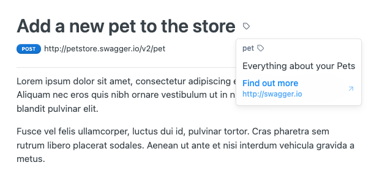

### Do we support OpenAPI Moonwalk?

* Yes
* No ✅

> ℹ️ Moonwalk is the codename for OpenAPI v4 and the specification changes the OpenAPI team are making are still in the planning phase.

### What auth types **don't** we support?

* apiKey
* http
* mutualTLS ✅
* oauth2
* openIdConnect ✅

### Where do we support XML?

* Parameters
* Request examples
* Custom code snippets ✅
* Response examples
* Response payloads ✅
* We don't support XML!

## 🕵️ API Explorer

### Do we support file uploads?

* Yes ✅
* No

### Can people write their own code snippets?

* Yes ✅
* No
* Sort of? ✅

> ℹ️ Though people can define custom code samples with our `x-readme.code-samples` OpenAPI extension, the code samples there are fully static and will not contain data from the API Explorer form.

### How do you disable "Try It"?

* You can't.
* The `x-explorer-enabled` extension. ✅

### How do you disable Metrics in the Explorer?

* You can't.
* The `x-metrics-enabled` extension. ✅

## 🆘 Spec validation

> ℹ️ These are all real validation errors that came in recently through the #oas-errors channel. Join it if you love Slack noise!

### Empty `required: []`
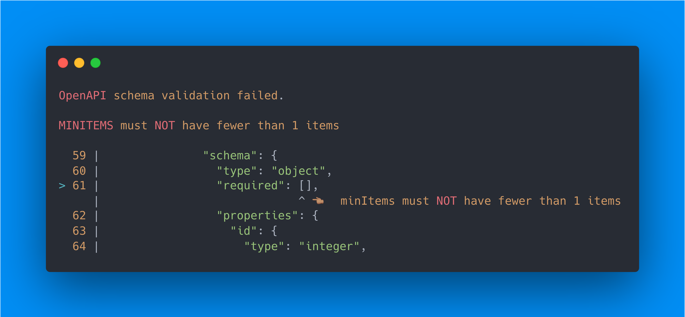

[🔗 See on carbon.sh](https://carbon.now.sh/?bg=rgba%281%2C142%2C245%2C1%29&t=one-dark&wt=none&l=auto&width=680&ds=true&dsyoff=20px&dsblur=68px&wc=true&wa=true&pv=56px&ph=56px&ln=false&fl=1&fm=Hack&fs=14px&lh=133%25&si=false&es=2x&wm=false&code=OpenAPI%2520schema%2520validation%2520failed.%250A%250AMINITEMS%2520must%2520NOT%2520have%2520fewer%2520than%25201%2520items%250A%250A%2520%252059%2520%257C%2520%2520%2520%2520%2520%2520%2520%2520%2520%2520%2520%2520%2520%2520%2520%2522schema%2522%253A%2520%257B%250A%2520%252060%2520%257C%2520%2520%2520%2520%2520%2520%2520%2520%2520%2520%2520%2520%2520%2520%2520%2520%2520%2522type%2522%253A%2520%2522object%2522%252C%250A%253E%252061%2520%257C%2520%2520%2520%2520%2520%2520%2520%2520%2520%2520%2520%2520%2520%2520%2520%2520%2520%2522required%2522%253A%2520%255B%255D%252C%250A%2520%2520%2520%2520%2520%257C%2520%2520%2520%2520%2520%2520%2520%2520%2520%2520%2520%2520%2520%2520%2520%2520%2520%2520%2520%2520%2520%2520%2520%2520%2520%2520%2520%2520%2520%255E%2520%25F0%259F%2591%2588%25F0%259F%258F%25BD%2520%2520minItems%2520must%2520NOT%2520have%2520fewer%2520than%25201%2520items%250A%2520%252062%2520%257C%2520%2520%2520%2520%2520%2520%2520%2520%2520%2520%2520%2520%2520%2520%2520%2520%2520%2522properties%2522%253A%2520%257B%250A%2520%252063%2520%257C%2520%2520%2520%2520%2520%2520%2520%2520%2520%2520%2520%2520%2520%2520%2520%2520%2520%2520%2520%2522id%2522%253A%2520%257B%250A%2520%252064%2520%257C%2520%2520%2520%2520%2520%2520%2520%2520%2520%2520%2520%2520%2520%2520%2520%2520%2520%2520%2520%2520%2520%2522type%2522%253A%2520%2522integer%2522%252C)

1. `required` should be a `true` or `false`
2. `required` should contain fields ✅

### Improperly placed operation
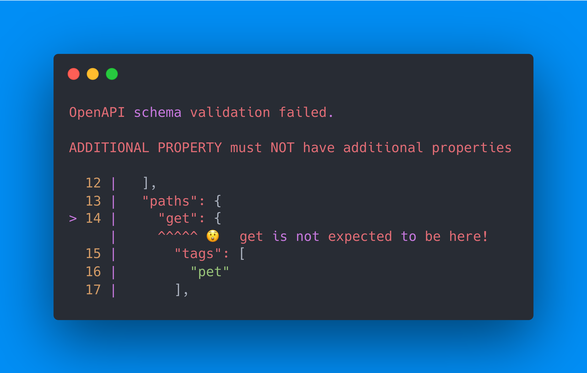

[🔗 See on carbon.sh](https://carbon.now.sh/?bg=rgba%281%2C142%2C245%2C1%29&t=one-dark&wt=none&l=auto&width=680&ds=true&dsyoff=20px&dsblur=68px&wc=true&wa=true&pv=56px&ph=56px&ln=false&fl=1&fm=Hack&fs=14px&lh=133%25&si=false&es=4x&wm=false&code=OpenAPI%2520schema%2520validation%2520failed.%250A%250AADDITIONAL%2520PROPERTY%2520must%2520NOT%2520have%2520additional%2520properties%250A%250A%2520%252012%2520%257C%2520%2520%2520%255D%252C%250A%2520%252013%2520%257C%2520%2520%2520%2522paths%2522%253A%2520%257B%250A%253E%252014%2520%257C%2520%2520%2520%2520%2520%2522get%2522%253A%2520%257B%250A%2520%2520%2520%2520%2520%257C%2520%2520%2520%2520%2520%255E%255E%255E%255E%255E%2520%25F0%259F%2598%25B2%2520%2520get%2520is%2520not%2520expected%2520to%2520be%2520here%21%250A%2520%252015%2520%257C%2520%2520%2520%2520%2520%2520%2520%2522tags%2522%253A%2520%255B%250A%2520%252016%2520%257C%2520%2520%2520%2520%2520%2520%2520%2520%2520%2522pet%2522%250A%2520%252017%2520%257C%2520%2520%2520%2520%2520%2520%2520%255D%252C)

1. `get` should start with a slash
2. The operation should be moved into being a `$ref`
3. The operation should be moved into a path. ✅

### Bad component name

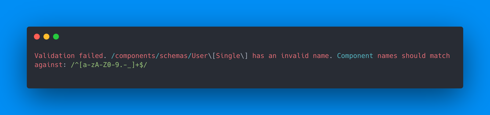

[🔗 See on carbon.sh](https://carbon.now.sh/?bg=rgba%281%2C142%2C245%2C1%29&t=one-dark&wt=none&l=auto&width=680&ds=true&dsyoff=20px&dsblur=68px&wc=true&wa=true&pv=56px&ph=56px&ln=false&fl=1&fm=Hack&fs=14px&lh=133%25&si=false&es=4x&wm=false&code=Validation%2520failed.%2520%252Fcomponents%252Fschemas%252FUser%255C%255BSingle%255C%255D%2520has%2520an%2520invalid%2520name.%2520Component%2520names%2520should%2520match%2520against%253A%2520%252F%255E%255Ba-zA-Z0-9.-_%255D%252B%2524%252F%250A)

#### How can you fix this?

1. Rename `User\[Single\]` to `User\\[Single\\]`
2. Change the `$ref` pointer to `User\Single`
3. Rename `User\[Single\]` to `User_Single` ✅

#### Why does this validation error look different?

> ℹ️ This validation error looks different because our OpenAPI validator runs two forms of validation: schema and specification. The **schema** validation it does is very basic level "does the file have these handful of required things", "do schemas have valid names", whereas **specification** validation is much more indepth and will surface line numbers to errors.

### Missing paths

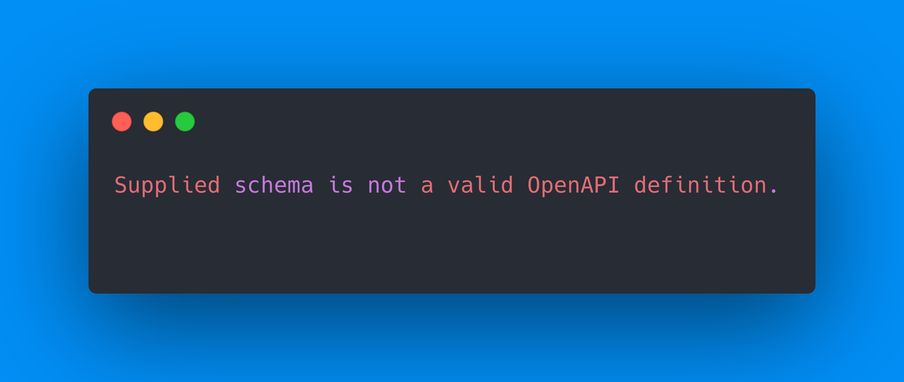

[🔗 See on carbon.sh](https://carbon.now.sh/?bg=rgba%281%2C142%2C245%2C1%29&t=one-dark&wt=none&l=auto&width=680&ds=true&dsyoff=20px&dsblur=68px&wc=true&wa=true&pv=56px&ph=56px&ln=false&fl=1&fm=Hack&fs=14px&lh=133%25&si=false&es=4x&wm=false&code=Supplied%2520schema%2520is%2520not%2520a%2520valid%2520OpenAPI%2520definition.)

#### What does this mean?

* The spec isn't valid, duh ✅
* Spec is missing `openapi` or `info` ✅
* Spec is OpenAPI 3.0 but has no `paths` ✅
* Spec is OpenAPI 3.1 but only contains `webhooks` ✅
* This error sucks and we should do better ✅

### Invalid JSON

[🔗 See on carbon.sh](https://carbon.now.sh/?bg=rgba%281%2C142%2C245%2C1%29&t=one-dark&wt=none&l=auto&width=680&ds=true&dsyoff=20px&dsblur=68px&wc=true&wa=true&pv=56px&ph=56px&ln=false&fl=1&fm=Hack&fs=14px&lh=133%25&si=false&es=4x&wm=false&code=Unexpected%2520string%2520in%2520JSON%2520at%2520position%2520832%250A)

* This is actually a YAML file.
* There's probably a missing comma. ✅
* There's probably an unclosed quote. ✅

#### How can we better catch these?

Unfortunately without writing our own JSON parser we can't easily tell a user where the problem is but if they open up the file in a code editor that should tell them where the problem is.

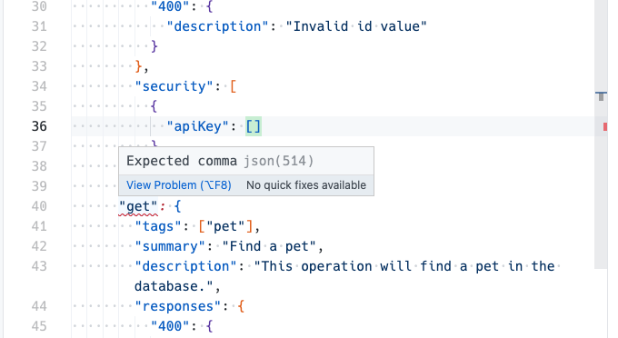

### Missing path params

[🔗 See on carbon.sh](https://carbon.now.sh/?bg=rgba%281%2C142%2C245%2C1%29&t=one-dark&wt=none&l=auto&width=680&ds=true&dsyoff=20px&dsblur=68px&wc=true&wa=true&pv=56px&ph=56px&ln=false&fl=1&fm=Hack&fs=14px&lh=133%25&si=false&es=4x&wm=false&code=Validation%2520failed.%2520%252Fpaths%252Fpet%252F%257Bid%257D%252Fput%2520is%2520missing%2520path%2520parameter%28s%29%2520for%2520%257Bid%257D%250A)

* `/pet/{id}` should be written as `/pet/:id`
* There's no `id` parameter ✅

> ℹ️ Unlike all other parameters where if it's missing we don't care, path params are required to make API calls so if one isn't defined we throw a validation error.

### Optional path param

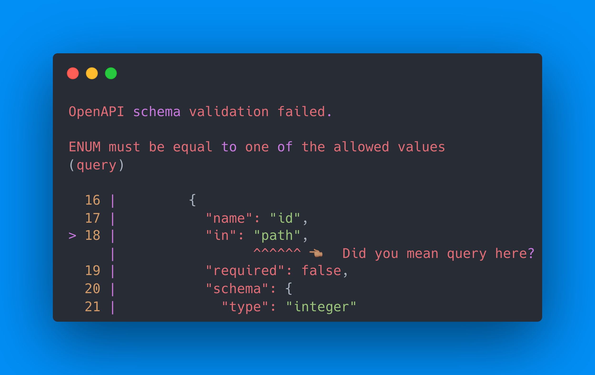

[🔗 See on carbon.sh](https://carbon.now.sh/?bg=rgba%281%2C142%2C245%2C1%29&t=one-dark&wt=none&l=auto&width=680&ds=true&dsyoff=20px&dsblur=68px&wc=true&wa=true&pv=56px&ph=56px&ln=false&fl=1&fm=Hack&fs=14px&lh=133%25&si=false&es=4x&wm=false&code=OpenAPI%2520schema%2520validation%2520failed.%250A%250AENUM%2520must%2520be%2520equal%2520to%2520one%2520of%2520the%2520allowed%2520values%250A%28query%29%250A%250A%2520%252016%2520%257C%2520%2520%2520%2520%2520%2520%2520%2520%2520%257B%250A%2520%252017%2520%257C%2520%2520%2520%2520%2520%2520%2520%2520%2520%2520%2520%2522name%2522%253A%2520%2522id%2522%252C%250A%253E%252018%2520%257C%2520%2520%2520%2520%2520%2520%2520%2520%2520%2520%2520%2522in%2522%253A%2520%2522path%2522%252C%250A%2520%2520%2520%2520%2520%257C%2520%2520%2520%2520%2520%2520%2520%2520%2520%2520%2520%2520%2520%2520%2520%2520%2520%255E%255E%255E%255E%255E%255E%2520%25F0%259F%2591%2588%25F0%259F%258F%25BD%2520%2520Did%2520you%2520mean%2520query%2520here%253F%250A%2520%252019%2520%257C%2520%2520%2520%2520%2520%2520%2520%2520%2520%2520%2520%2522required%2522%253A%2520false%252C%250A%2520%252020%2520%257C%2520%2520%2520%2520%2520%2520%2520%2520%2520%2520%2520%2522schema%2522%253A%2520%257B%250A%2520%252021%2520%257C%2520%2520%2520%2520%2520%2520%2520%2520%2520%2520%2520%2520%2520%2522type%2522%253A%2520%2522integer%2522)

* This error is garb ✅
* `id` should actually be a query parameter
* `required: false` should be `required: true` ✅

> ℹ️ All path parameters must be required! And yes this error message is garbage

### Invalid response HTTP code

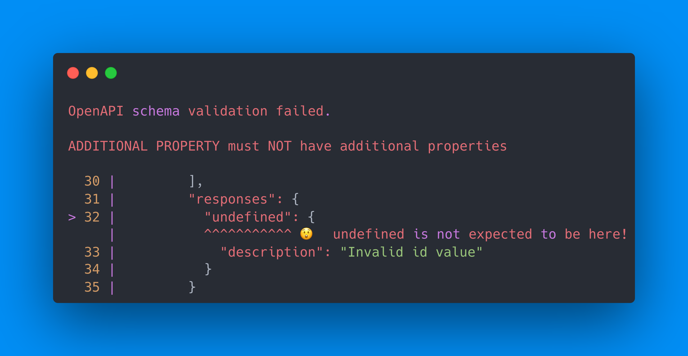

[🔗 See on carbon.sh](https://carbon.now.sh/?bg=rgba%281%2C142%2C245%2C1%29&t=one-dark&wt=none&l=auto&width=680&ds=true&dsyoff=20px&dsblur=68px&wc=true&wa=true&pv=56px&ph=56px&ln=false&fl=1&fm=Hack&fs=14px&lh=133%25&si=false&es=4x&wm=false&code=OpenAPI%2520schema%2520validation%2520failed.%250A%250AADDITIONAL%2520PROPERTY%2520must%2520NOT%2520have%2520additional%2520properties%250A%250A%2520%252030%2520%257C%2520%2520%2520%2520%2520%2520%2520%2520%2520%255D%252C%250A%2520%252031%2520%257C%2520%2520%2520%2520%2520%2520%2520%2520%2520%2522responses%2522%253A%2520%257B%250A%253E%252032%2520%257C%2520%2520%2520%2520%2520%2520%2520%2520%2520%2520%2520%2522undefined%2522%253A%2520%257B%250A%2520%2520%2520%2520%2520%257C%2520%2520%2520%2520%2520%2520%2520%2520%2520%2520%2520%255E%255E%255E%255E%255E%255E%255E%255E%255E%255E%255E%2520%25F0%259F%2598%25B2%2520%2520undefined%2520is%2520not%2520expected%2520to%2520be%2520here%21%250A%2520%252033%2520%257C%2520%2520%2520%2520%2520%2520%2520%2520%2520%2520%2520%2520%2520%2522description%2522%253A%2520%2522Invalid%2520id%2520value%2522%250A%2520%252034%2520%257C%2520%2520%2520%2520%2520%2520%2520%2520%2520%2520%2520%257D%250A%2520%252035%2520%257C%2520%2520%2520%2520%2520%2520%2520%2520%2520%257D)

* `undefined` shouldn't be there... ✅
* `undefined` should be something like `application/json`
* `undefined` should be an HTTP status code ✅

### Invalid schema type

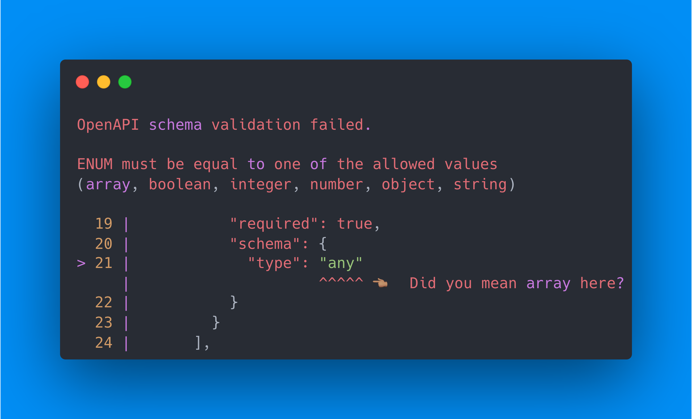

[🔗 See on carbon.sh](https://carbon.now.sh/?bg=rgba%281%2C142%2C245%2C1%29&t=one-dark&wt=none&l=auto&width=680&ds=true&dsyoff=20px&dsblur=68px&wc=true&wa=true&pv=56px&ph=56px&ln=false&fl=1&fm=Hack&fs=14px&lh=133%25&si=false&es=4x&wm=false&code=OpenAPI%2520schema%2520validation%2520failed.%250A%250AENUM%2520must%2520be%2520equal%2520to%2520one%2520of%2520the%2520allowed%2520values%250A%28array%252C%2520boolean%252C%2520integer%252C%2520number%252C%2520object%252C%2520string%29%250A%250A%2520%252019%2520%257C%2520%2520%2520%2520%2520%2520%2520%2520%2520%2520%2520%2522required%2522%253A%2520true%252C%250A%2520%252020%2520%257C%2520%2520%2520%2520%2520%2520%2520%2520%2520%2520%2520%2522schema%2522%253A%2520%257B%250A%253E%252021%2520%257C%2520%2520%2520%2520%2520%2520%2520%2520%2520%2520%2520%2520%2520%2522type%2522%253A%2520%2522any%2522%250A%2520%2520%2520%2520%2520%257C%2520%2520%2520%2520%2520%2520%2520%2520%2520%2520%2520%2520%2520%2520%2520%2520%2520%2520%2520%2520%2520%255E%255E%255E%255E%255E%2520%25F0%259F%2591%2588%25F0%259F%258F%25BD%2520%2520Did%2520you%2520mean%2520array%2520here%253F%250A%2520%252022%2520%257C%2520%2520%2520%2520%2520%2520%2520%2520%2520%2520%2520%257D%250A%2520%252023%2520%257C%2520%2520%2520%2520%2520%2520%2520%2520%2520%257D%250A%2520%252024%2520%257C%2520%2520%2520%2520%2520%2520%2520%255D%252C)

* `type` should be set to `["any"]`
* `type` should be set to `string`
* `type` should be an `anyOf` ✅

> ℹ️ If they truly want anything to be specified to this piece of data they should change this to an `anyOf` where each option in the `anyOf` is each `type` that we support: `array`, `boolean`, `integer`, `number`, `object`, `string`

### Empty responses

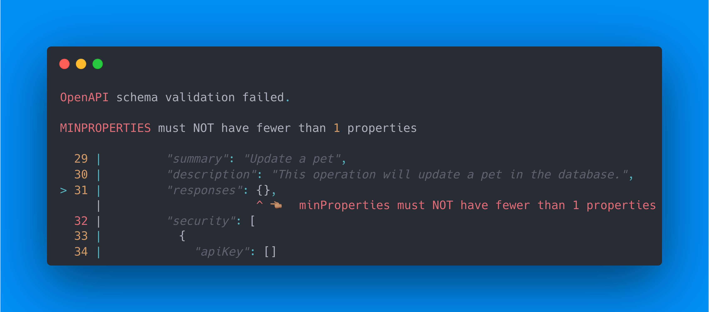

[🔗 See on carbon.sh](https://carbon.now.sh/?bg=rgba%281%2C142%2C245%2C1%29&t=one-dark&wt=none&l=auto&width=680&ds=true&dsyoff=20px&dsblur=68px&wc=true&wa=true&pv=56px&ph=56px&ln=false&fl=1&fm=Hack&fs=14px&lh=133%25&si=false&es=4x&wm=false&code=OpenAPI%2520schema%2520validation%2520failed.%250A%250AMINPROPERTIES%2520must%2520NOT%2520have%2520fewer%2520than%25201%2520properties%250A%250A%2520%252029%2520%257C%2520%2520%2520%2520%2520%2520%2520%2520%2520%2522summary%2522%253A%2520%2522Update%2520a%2520pet%2522%252C%250A%2520%252030%2520%257C%2520%2520%2520%2520%2520%2520%2520%2520%2520%2522description%2522%253A%2520%2522This%2520operation%2520will%2520update%2520a%2520pet%2520in%2520the%2520database.%2522%252C%250A%253E%252031%2520%257C%2520%2520%2520%2520%2520%2520%2520%2520%2520%2522responses%2522%253A%2520%257B%257D%252C%250A%2520%2520%2520%2520%2520%257C%2520%2520%2520%2520%2520%2520%2520%2520%2520%2520%2520%2520%2520%2520%2520%2520%2520%2520%2520%2520%2520%2520%255E%2520%25F0%259F%2591%2588%25F0%259F%258F%25BD%2520%2520minProperties%2520must%2520NOT%2520have%2520fewer%2520than%25201%2520properties%250A%2520%252032%2520%257C%2520%2520%2520%2520%2520%2520%2520%2520%2520%2522security%2522%253A%2520%255B%250A%2520%252033%2520%257C%2520%2520%2520%2520%2520%2520%2520%2520%2520%2520%2520%257B%250A%2520%252034%2520%257C%2520%2520%2520%2520%2520%2520%2520%2520%2520%2520%2520%2520%2520%2522apiKey%2522%253A%2520%255B%255D)

* `responses` must contain responses ✅
* `responses` can be deleted
* Change `openapi` to `openapi: 3.1.0` ✅

> ℹ️ Under OpenAPI 3.0 `responses` must always be defined on operations, and it must contain at least one defined HTTP code response. On OpenAPI 3.1 however, `responses` is optional so if they change their spec to target that this error will go away.

### Misplaced param style

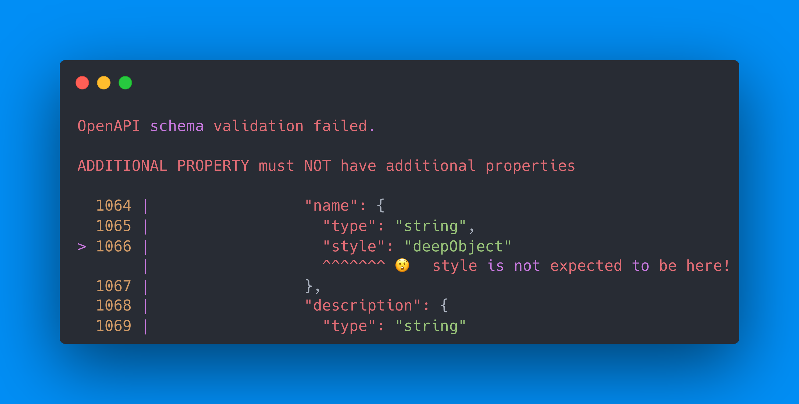

[🔗 See on carbon.sh](https://carbon.now.sh/?bg=rgba%281%2C142%2C245%2C1%29&t=one-dark&wt=none&l=auto&width=680&ds=true&dsyoff=20px&dsblur=68px&wc=true&wa=true&pv=56px&ph=56px&ln=false&fl=1&fm=Hack&fs=14px&lh=133%25&si=false&es=4x&wm=false&code=OpenAPI%2520schema%2520validation%2520failed.%250A%250AADDITIONAL%2520PROPERTY%2520must%2520NOT%2520have%2520additional%2520properties%250A%250A%2520%25201064%2520%257C%2520%2520%2520%2520%2520%2520%2520%2520%2520%2520%2520%2520%2520%2520%2520%2520%2520%2522name%2522%253A%2520%257B%250A%2520%25201065%2520%257C%2520%2520%2520%2520%2520%2520%2520%2520%2520%2520%2520%2520%2520%2520%2520%2520%2520%2520%2520%2522type%2522%253A%2520%2522string%2522%252C%250A%253E%25201066%2520%257C%2520%2520%2520%2520%2520%2520%2520%2520%2520%2520%2520%2520%2520%2520%2520%2520%2520%2520%2520%2522style%2522%253A%2520%2522deepObject%2522%250A%2520%2520%2520%2520%2520%2520%2520%257C%2520%2520%2520%2520%2520%2520%2520%2520%2520%2520%2520%2520%2520%2520%2520%2520%2520%2520%2520%255E%255E%255E%255E%255E%255E%255E%2520%25F0%259F%2598%25B2%2520%2520style%2520is%2520not%2520expected%2520to%2520be%2520here%21%250A%2520%25201067%2520%257C%2520%2520%2520%2520%2520%2520%2520%2520%2520%2520%2520%2520%2520%2520%2520%2520%2520%257D%252C%250A%2520%25201068%2520%257C%2520%2520%2520%2520%2520%2520%2520%2520%2520%2520%2520%2520%2520%2520%2520%2520%2520%2522description%2522%253A%2520%257B%250A%2520%25201069%2520%257C%2520%2520%2520%2520%2520%2520%2520%2520%2520%2520%2520%2520%2520%2520%2520%2520%2520%2520%2520%2522type%2522%253A%2520%2522string%2522)

* We don't support `style`
* We don't support `deepObject`
* `style` is only supported on top-level parameters ✅
* `style` is unsupported on parameter object properties

### YAML quirks

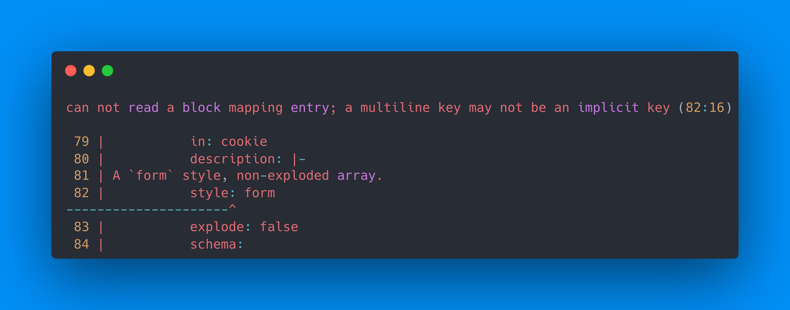

[🔗 See on carbon.sh](https://carbon.now.sh/?bg=rgba%281%2C142%2C245%2C1%29&t=one-dark&wt=none&l=auto&width=680&ds=true&dsyoff=20px&dsblur=68px&wc=true&wa=true&pv=56px&ph=56px&ln=false&fl=1&fm=Hack&fs=14px&lh=133%25&si=false&es=4x&wm=false&code=can%2520not%2520read%2520a%2520block%2520mapping%2520entry%253B%2520a%2520multiline%2520key%2520may%2520not%2520be%2520an%2520implicit%2520key%2520%2882%253A16%29%250A%250A%252079%2520%257C%2520%2520%2520%2520%2520%2520%2520%2520%2520%2520%2520in%253A%2520cookie%250A%252080%2520%257C%2520%2520%2520%2520%2520%2520%2520%2520%2520%2520%2520description%253A%2520%257C-%250A%252081%2520%257C%2520A%2520%2560form%2560%2520style%252C%2520non-exploded%2520array.%250A%252082%2520%257C%2520%2520%2520%2520%2520%2520%2520%2520%2520%2520%2520style%253A%2520form%250A---------------------%255E%250A%252083%2520%257C%2520%2520%2520%2520%2520%2520%2520%2520%2520%2520%2520explode%253A%2520false%250A%252084%2520%257C%2520%2520%2520%2520%2520%2520%2520%2520%2520%2520%2520schema%253A)

* We don't support multiline descriptions.
* The description is indented improperly. ✅
* We don't support YAML.

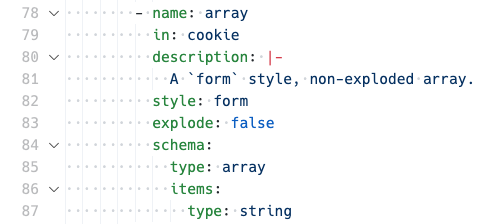
