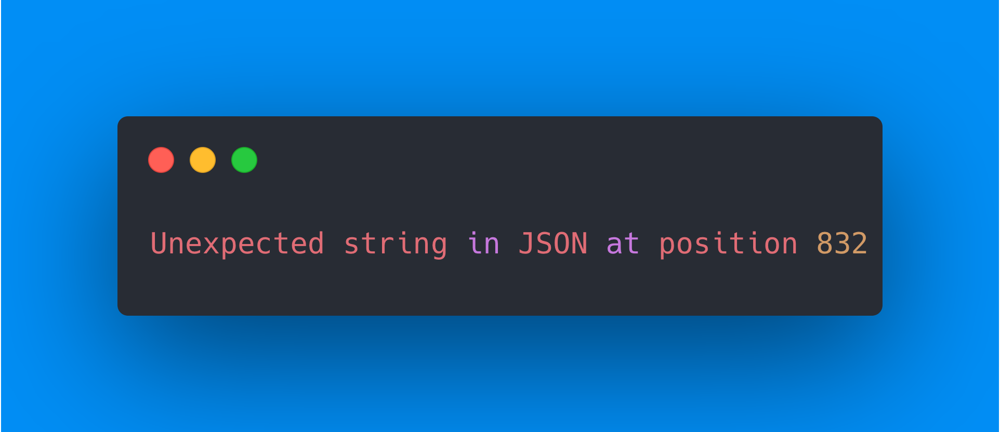
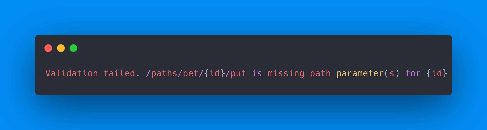

# OpenAPI: ...uh what

> It's been a while but it's time for the the return of "OpenAPI: uh... what's wrong here?", as previously seen at a few offsites and impromptu Monday syncs. Come and let me pick your brain with a Kahoot on various real-world OpenAPI problems that we've come across over the years. Bring your phone and leave the scantrons at home.

Carbon template used for screenshots: https://carbon.now.sh/?bg=rgba%281%2C142%2C245%2C1%29&t=one-dark&wt=none&l=auto&width=680&ds=true&dsyoff=20px&dsblur=68px&wc=true&wa=true&pv=56px&ph=56px&ln=false&fl=1&fm=Hack&fs=14px&lh=133%25&si=false&es=4x&wm=false&code=OpenAPI%2520schema%2520validation%2520failed.%250A%250AENUM%2520must%2520be%2520equal%2520to%2520one%2520of%2520the%2520allowed%2520values%250A%28query%29%250A%250A%2520%252016%2520%257C%2520%2520%2520%2520%2520%2520%2520%2520%2520%257B%250A%2520%252017%2520%257C%2520%2520%2520%2520%2520%2520%2520%2520%2520%2520%2520%2522name%2522%253A%2520%2522id%2522%252C%250A%253E%252018%2520%257C%2520%2520%2520%2520%2520%2520%2520%2520%2520%2520%2520%2522in%2522%253A%2520%2522path%2522%252C%250A%2520%2520%2520%2520%2520%257C%2520%2520%2520%2520%2520%2520%2520%2520%2520%2520%2520%2520%2520%2520%2520%2520%2520%255E%255E%255E%255E%255E%255E%2520%25F0%259F%2591%2588%25F0%259F%258F%25BD%2520%2520Did%2520you%2520mean%2520query%2520here%253F%250A%2520%252019%2520%257C%2520%2520%2520%2520%2520%2520%2520%2520%2520%2520%2520%2522required%2522%253A%2520false%252C%250A%2520%252020%2520%257C%2520%2520%2520%2520%2520%2520%2520%2520%2520%2520%2520%2522schema%2522%253A%2520%257B%250A%2520%252021%2520%257C%2520%2520%2520%2520%2520%2520%2520%2520%2520%2520%2520%2520%2520%2522type%2522%253A%2520%2522integer%2522

## 📚 Spec Coverage

### What is OpenAPI?

* A bunch of JSON ✅
* Standardized way to describe APIs ✅
* A giant headache ✅

### What types of APIs can you document in OpenAPI?

* RESTFul ✅
* GraphQL
* RPC

### What types of specs do we support?

* Swagger 2 ✅
* OpenAPI 3+ ✅
* GraphQL ✅
* Postman ✅

### Do we support OAuth?

* Yes
* No
* Sort of? ✅

> ℹ️ We support OAuth!*
>
> 
>
> Though we don't support any proper OAuth flows where we request a token on your behalf, we do support being able to make API requests with existing OAuth tokens — either supplied by the user or through a JWT.

### Do we support callbacks?

* Yes
* No
* Sort of? ✅

> ℹ️ We support callbacks!*
>
> 
>
> Though we don't support any proper OAuth flows where we request a token on your behalf, we **do** support being able to make API requests with existing OAuth tokens — either supplied by the user or through a JWT.

### Do we support links?

* Yes
* No ✅
* Sort of?

> ℹ️ We don't support links :(
>
> 
>
> Links are ways to "link" API endpoints to other API endpoints by utilizing the response from one to apply it to another. For example, an endpoint in a video API to upload a video might have a "link" to retrieve the transcoding status of that video.

### Where do we surface tag metadata?

* We don't
* In the sidebar
* On the reference page ✅

> ℹ️ We surface tag metadata on the reference page!
>
> 

### Do we support OpenAPI Moonwalk?

* Yes
* No ✅

> ℹ️ OpenAPI Moonwalk isn't real (yet)
>
> 
>
> Moonwalk is the codename for OpenAPI v4 and the specification changes the OpenAPI team are doing are still in the planning phase.

### What types of auth do we support?

* apiKey ✅
* http ✅
* mutualTLS
* oauth2 ✅

### Where do we support XML?

* Request and response examples
* Custom code snippets ✅
* Response payloads ✅
* We don't support XML!

## 🕵️ API Explorer

### Do we support multipart requests in "Try It"?

* Yes ✅
* No

### Can projects write their own code snippets?

* Yes, but they're static ✅
* Yes, and they're interactive
* Yes, but only for the manual API
* No

> ℹ️ Sort of!
>
> 
>
> Though people can define custom code samples with our `x-readme.code-samples` OpenAPI extension, the code samples there are fully static and will not contain data from the API Explorer form.

### How do you disable "Try It"?

* You can't.
* The `x-explorer-enabled` extension. ✅

### How do you disable Metrics in the Explorer?

* You can't.
* The `x-metrics-enabled` extension. ✅

## 🆘 Spec validation

There have been 42,070 validation errors posted to `#oas-errors` in the past 30 days. The following are all real errors.

### Empty `required: []`

#### How can you fix this?

1. `required` should be a `true` or `false`
2. `required` should contain data ✅

### Improperly placed operation

#### How can you fix this?

1. `get` should start with a slash
2. This should be replaced with a `$ref` pointer.
3. The operation should be moved into a path. ✅

### Bad component name

#### How can you fix this?

1. Rename `User\[Single\]` to `User\\[Single\\]`
2. Change the `$ref` pointer to `User\Single`
3. Rename `User\[Single\]` to `User_Single` ✅

### Missing paths

#### What does this mean?

* Spec is missing `openapi` or `info` ✅
* Spec is OpenAPI 3.0 but has no `paths` ✅
* Spec is OpenAPI 3.1 but only contains `webhooks` ✅
* This error sucks and we should do better ✅

### Invalid JSON

#### What does this mean?

* This is actually a YAML file.
* They didn't validate their JSON. ✅
* There's probably a missing comma. ✅
* There's probably an unclosed quote. ✅

> ℹ️ How can we better catch these?
>
> 
>
> Unfortunately without writing our own JSON parser we can't easily tell a user where the problem is but if they open up the file in a code editor that should tell them where the problem is.

### Missing path params

#### How can you fix this?

* `/pet/{id}` should be written as `/pet/:id`
* Delete `/{id}` from the path
* Add an `id` parameter to the operation ✅
* Add an `id` parameter to `#/components/schemas`

> ℹ️ Path params are always required
>
> 
>
> Unlike all other parameters where if it's missing we don't care, path params are required to make API calls so if one isn't defined we throw a validation error.

### Optional path param

[🔗 See on carbon.sh]()

#### How can you fix this?

* This error is garb ✅
* `id` should actually be a query parameter
* `required: false` should be `required: true` ✅

> ℹ️ Why can't I make this a query parameter?
>
> Because path parameters must be required, changing this to be a query parameter will cause a "missing path parameter" validation error to appear. Yes, this error is garbage.

### Invalid response HTTP code

#### How can you fix this?

* `undefined` shouldn't be there... ✅
* `undefined` should be something like `application/json`
* `undefined` should be an HTTP status code ✅

### Invalid schema type

#### How can you fix this?

* `type` should be set to `["any"]`
* `type` should be set to `string`
* `type` should be set to `true` (OpenAPI 3.1) ✅
* The `schema` should be an `anyOf` of different `type`s ✅

### Empty responses

#### What does this mean?

* `responses` must contain responses ✅
* `responses` can be deleted
* Change `openapi` to `openapi: 3.1.0` ✅

> ℹ️ Responses aren't always required
>
> 
>
> Under OpenAPI 3.0 responses must always be defined on operations, and it must contain at least one defined HTTP code response. On OpenAPI 3.1 however, responses are optional so if they change their spec to target that this error will go away.

### Misplaced param style

#### How can you fix this?

* We don't support `style`
* We don't support `deepObject`
* `style` is only supported on top-level parameters ✅
* `style` is unsupported on parameter object properties

### YAML quirks

#### What does this mean?
* We don't support multiline descriptions.
* The description is indented improperly. ✅
* We don't support YAML.

#### Example fix

